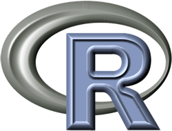

## Basic Workflow 3: Visual Styles

by [Kazuhiro Takemoto](https://sites.google.com/site/kztakemoto/r-seminar-on-igraph---supplementary-information)*


Updated by [Keiichiro Ono](http://keiono.github.io/)


(The original tutorial was developed by Dr. Takemoto, and updated by Keiichiro Ono for cy-rest.)

----

  


## Introduction
Welcome to part 3 of the R tutorial.  In this section, you will learn how to create your own Visual Styles programmatically.


```{r}
# Basic setup
library(igraph)
library(RJSONIO)
library(httr)

port.number = 1234
base.url = paste("http://localhost:", toString(port.number), "/v1", sep="")
source('toCytoscape.R')
```

### Reload the Data
In this tutorial, we will use the same sample data as we used in the last section.  Let's reload everything again.


```{r}
network.df <- read.table("data/eco_EM+TCA.txt")
network <- graph.data.frame(network.df,directed=T)
g.tca <- simplify(network, remove.multiple=T, remove.loops=T)
g.tca$name = "Ec TCA Cycle"
```


## Understanding Visual Style

### Path Visualization
To understand Styles in Cytoscape, let's visualize shortest path between two nodes in the network.

#### Find Paths in igraph 
There are many built-in path finding algorithms in igraph.

* Find all shortest paths from _D-Glucose_ to _2-Oxoglutarate_

```{r}
paths <- get.all.shortest.paths(g.tca,"D-Glucose","2-Oxoglutarate",mode="out")

# Nodes in the first path
print(V(g.tca)[paths$res[[1]]])

# Add new attribute "path" and set value 1 for this path
V(g.tca)[paths$res[[1]]]$path <- 1

# Edges in the path
print(E(g.tca,path=paths$res[[1]]))

# Add path attribute
E(g.tca, path=paths$res[[1]])$path <- 1
```

### _Styles_ in Cytoscape
In igraph _plot_ function, you need to specify actual visual property values directly.  For example, if you want to paint the path found in the previous section in red, you need to set actual color (red) for each edge in the path.  Instead, Cytoscape used a mapping mechanism called __Visual Style__ and __you can reuse the mapping instructions for multiple networks__.  For more details, please read the [manual](http://wiki.cytoscape.org/Cytoscape_3/UserManual/Styles).


#### Visualizing Paths
Because Style in Cytoscape is so flexible, there are many ways to visualize your 
The simplest way to visualize paths in Cytoscape is making a new attributes for the edges.

##### Design your Style
To understand basics of Style, let's build a simple Style from scratch including the following instructions:

* Paint nodes and edges on the path in red
* Use red for node labels
* Since this is a directed graph, add arrows to the edges

First, we need to set default values.  This is just an example.  Be creative to improve your visualizations!

```{r}
# Name of this new style
style.name = "PathVisualization3"

# Define default values
def.node.color <- list(
  visualProperty = "NODE_FILL_COLOR",
  value = "#EEEEEE"
)

def.node.size <- list(
  visualProperty = "NODE_SIZE",
  value = 12
)

def.node.border.width <- list(
  visualProperty = "NODE_BORDER_WIDTH",
  value = 0
)

def.edge.width <- list(
  visualProperty = "EDGE_WIDTH",
  value = 2
)

def.edge.color <- list(
  visualProperty = "EDGE_STROKE_UNSELECTED_PAINT",
  value = "#aaaaaa"
)

def.edge.target.arrow.color = list(
  visualProperty="EDGE_TARGET_ARROW_UNSELECTED_PAINT",
  value = "#aaaaaa"
)

def.node.labelposition <- list(
  visualProperty = "NODE_LABEL_POSITION",
  value = "S,NW,c,6.00,0.00"  
)

def.edge.target.arrow <- list(
  visualProperty="EDGE_TARGET_ARROW_SHAPE",
  value="ARROW"
)

defaults <- list(def.node.color, def.node.size, def.node.labelposition, 
                 def.edge.color, def.node.border.width, def.edge.target.arrow, 
                 def.edge.width, def.edge.target.arrow.color)
```

It looks complicated, but actually it's simple.  All you have to do is defining key-value pair for each visual variables you want to change.  It's just like CSS.

##### Mappings
__Visual Mapping__ is the most important concept in Cytoscape.  In Cytoscape, __data controls the view__.  This means, once mapping is set, color, size, shape, or all other visual variables are controlled by one of the column values in your data table.

Let's define a simple mapping: _if path value is 1, use RED for painting objects_.


```{r}
# Visual Mappings
mappings = list()

# Actual mapping.  This is a reusable component.
pair1 = list(
  key = "1",
  value = "red"
)

# This mapping object is also reusable!
discrete.mappings = list(pair1)

# Assign the map for node, edge, and label colors.
node.color = list(
  mappingType="discrete",
  mappingColumn="path",
  mappingColumnType="Integer",
  visualProperty="NODE_FILL_COLOR",
  map = discrete.mappings
)

node.label.color = list(
  mappingType="discrete",
  mappingColumn="path",
  mappingColumnType="Integer",
  visualProperty="NODE_LABEL_COLOR",
  map = discrete.mappings
)

edge.color = list(
  mappingType="discrete",
  mappingColumn="path",
  mappingColumnType="Integer",
  visualProperty="EDGE_STROKE_UNSELECTED_PAINT",
  map = discrete.mappings
)

edge.target.arrow.color = list(
  mappingType="discrete",
  mappingColumn="path",
  mappingColumnType="Integer",
  visualProperty="EDGE_TARGET_ARROW_UNSELECTED_PAINT",
  map = discrete.mappings
)

# One more instruction.  Use "name" column for label.
node.label = list(
  mappingType="passthrough",
  mappingColumn="name",
  mappingColumnType="String",
  visualProperty="NODE_LABEL"
)

mappings = list(node.color, node.label, node.label.color, edge.color, edge.target.arrow.color)

style <- list(title=style.name, defaults = defaults, mappings = mappings)
style.JSON <- toJSON(style)

style.url = paste(base.url, "styles", sep="/")
POST(url=style.url, body=style.JSON, encode = "json")
```

Well, this may look a bit cumbersome for the first time because we make everything from scratch.  However, in many cases, you can use preset Styles as your starting point and customize it for your purpose.  But remember, you made a reusable set of instructions how to visualize your result controled by the data.  __Style object is just like a CSS for Cytoscape.  It is reusable, and independent from your content (data)__.

In this section, you made a style programmatically, but of course, you can manually create Styles from GUI if you want.


#### Create Visualization with our Custom Style
Finally, send everything back to Cytoscape and visualize it!

```{r}
send2cy(toCytoscape(g.tca), style.name, 'circular')
```

Now you see the path!


